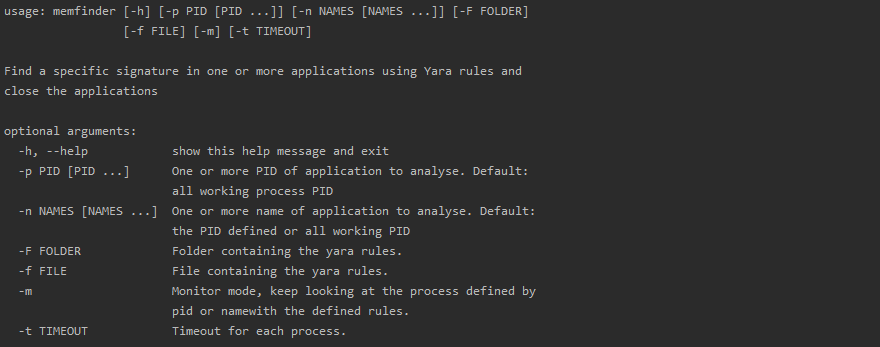

# MemFinder

This tool's purpose is to monitor the memory of one process or more and to kill it if there is a match with one or more of the yara rule files.
The main goal here is to find a proper way to handle fileless malwares through the analysis of the memory.

## Installation

You can install memfinder using this command.
```
pip install . -r requirements.txt
```

## Usage


 